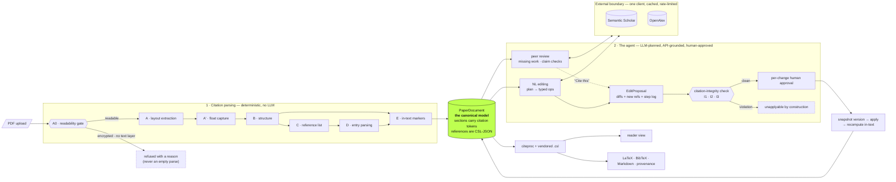

# Paper Improvement Agent

Upload a research paper PDF → see exactly how it was parsed → get a peer
review grounded in **real** academic search (Semantic Scholar + OpenAlex) →
improve the paper with natural-language commands → export the revised paper
as LaTeX. Citations are canonically **CSL-JSON**, rendered through
**citeproc** with real `.csl` styles, and protected by a citation-integrity
checker: no edit can silently drop a citation, and no citation can enter the
system without a real, linkable source.

## Watch it

[](screenshots/feature-tour.mp4)

The loop above plays right here — five moments from the tour, silent: the
parse stages landing one by one, a citation jumping to its entry, review
findings against live search, approving a diff, and the LaTeX view.

**[▶ Full feature tour — 3.8 min, with narration](screenshots/feature-tour.mp4)**
— click the loop or that link. GitHub strips `<video>` out of README files, so
the full film opens on its own page, where it plays in the browser. No
download either way.

The whole workflow on a real 24-page paper: upload and the six parse stages,
what the parser found and what it refused, citations as links, peer review
against live academic search, accepting a finding as a citation, editing by
command with the diff and integrity check, the editable LaTeX view, and
export. Built with [Remotion](https://github.com/remotion-dev/remotion) —
source and script in [`video/`](video), screenshots in
[`screenshots/`](screenshots).

## System design

The two pieces the brief asks about — **citation parsing** and **the agent** —
with the full write-up and all eight diagrams in
**[`docs/system-design.md`](docs/system-design.md)**. The shape of the whole
system:



Two invariants hold it together, and every arrow above is arranged to protect
them:

| Invariant | Enforced by |
|---|---|
| No citation is invented — every one traces to a real record | the external boundary is the *only* source of new references; integrity rule **I3** rejects any that arrives without provenance |
| No edit silently breaks a citation | citations live as **tokens** inside the text; rules **I1/I2** compare token multisets before and after, and a violating proposal cannot be applied |

**Read next:** [citation parsing](docs/system-design.md#piece-1--citation-parsing)
— pipeline stages, the intermediate representation between each, where
CSL-JSON sits, style detection and failure handling ·
[the agent](docs/system-design.md#piece-2--the-agent) — command → typed
operations, the Semantic Scholar / OpenAlex boundary, peer review, and how
citations stay intact across edits.

## Run it — Docker

Nothing but Docker needed (Compose v2). One process serves both the API and
the built frontend. Verified end to end: image builds, container reports
healthy, a real PDF parses inside it.

```bash
cp backend/.env.example backend/.env   # optional: add an OpenAI key, see Keys
docker compose up --build
```

Open **http://localhost:8000** and drop a PDF on the first screen. arXiv
papers work best — their references resolve on both APIs:

```bash
curl -L -o paper.pdf https://arxiv.org/pdf/1706.03762
```

Parsed papers live in `backend/data/`, mounted as a volume, so they survive
`docker compose down`. Keys are read from `backend/.env` at run time and are
never baked into the image. Use another port with `PIA_PORT=9000 docker
compose up`.

```bash
docker compose up -d --build     # background
docker compose logs -f           # follow logs
docker compose down              # stop (papers persist)
```

Updating is `git pull && docker compose up --build -d`. Dependency changes
rebuild automatically; the layer order means editing Python or TSX doesn't
reinstall anything.

## Run it — without Docker

For frontend hot-reload while developing. Requirements: Python 3.11+, Node
18+.

```bash
cd backend
python3 -m venv .venv && source .venv/bin/activate
pip install -r requirements.txt
cp .env.example .env
uvicorn app.main:app --port 8000
```

In a second terminal:

```bash
cd frontend
npm install
npm run dev                   # → http://localhost:5173, proxies /api to :8000
```

`PIA_BACKEND_URL` repoints the dev server if the backend isn't on :8000.
For a single process instead, `npm run build` in `frontend/` and the uvicorn
command above serves the built app at http://localhost:8000.

**Tests:**

```bash
cd backend && .venv/bin/python -m pytest tests/    # 123 tests, no network
docker compose run --rm app python -m pytest tests/    # or in the image
```

## Keys

All optional — put them in `backend/.env` (gitignored; `.env.example` lists
them). An exported shell variable overrides the file.

| Key | Effect if missing |
|---|---|
| `OPENAI_API_KEY` *(or `GEMINI_API_KEY`)* | Parsing, rendering, review search and export still work. Claim verdicts and agentic editing say they need an LLM rather than faking output. |
| `S2_API_KEY` | Semantic Scholar still works on the shared pool — slower and 429-prone. Free key, worth having. |
| `OPENALEX_MAILTO` | OpenAlex works without any key; this just puts calls in the polite pool. |

Check what the app actually has: `curl localhost:8000/api/health`.

<details>
<summary>Other settings (all have working defaults)</summary>

| Env var | Default | Meaning |
|---|---|---|
| `PIA_LLM_PROVIDER` | `auto` | `openai` \| `gemini` \| `auto` (first key present, prefers OpenAI) |
| `PIA_OPENAI_MODEL` / `PIA_GEMINI_MODEL` | `gpt-4o-mini` / `gemini-flash-latest` | model per provider |
| `PIA_MAX_QUERIES_PER_REVIEW` | 10 | cap on external searches per review |
| `PIA_MAX_CLAIM_CHECKS` | 12 | cap on claim–citation checks per review |
| `PIA_HTTP_MAX_RETRIES` | 3 | retries per external GET on transient 429/5xx. Raise it (e.g. `15`) on the *shared* unauthenticated Semantic Scholar pool. Quota-exhausted responses (OpenAlex "Insufficient budget") are never retried — they fail fast and are reported. |
| `PIA_HTTP_BACKOFF_CAP` | 10 | max seconds for one backoff sleep |
| `PIA_PARSE_MIN_SECONDS` | 0 | pads the parse so the stage view is legible in a demo; off by default |

</details>

## What it does

1. **Upload & parse.** The parse view narrates the pipeline's own stages
   (A → A′ → B → C → D → E) as they run, then shows the detected structure,
   the in-text citation style with confidence, and every reference with its
   parsed fields. Unparseable entries are kept and flagged, never dropped.
   Figures, tables and boxed panels are lifted out of the prose flow so their
   text can't bleed into paragraphs. A scanned PDF is refused with a reason
   rather than parsing to an empty document. *Resolve* matches references to
   OpenAlex / Semantic Scholar records via a DOI → arXiv → title ladder.
2. **Read.** The paper rendered with citeproc-formatted labels in the
   detected CSL style (APA, IEEE, Chicago, Harvard, Nature vendored). Click
   any citation to jump to its bibliography entry; a structure rail moves
   between sections.
3. **Peer review.** Missing-work search across both APIs, deduped against
   your bibliography, plus claim–citation checks that fetch the cited work's
   abstract and judge whether it supports your sentence — with a verbatim
   quote, verified against the real abstract before it is shown. Every
   finding links to a real source and states its provenance, including which
   searches failed. Accepting one ("Cite this") proposes citing that exact
   source at that exact sentence.
4. **Edit.** Commands like *"add more citations to the introduction"*. The
   agent plans typed operations, searches the real APIs, and returns a
   proposal: per-section diffs, new references with sources, an integrity
   report. You approve each change; violations are unapplyable by
   construction. Sections are also editable directly, in the reader or in
   the LaTeX view.
5. **Export.** A LaTeX project zip: `main.tex`, `references.bib`, `paper.md`,
   `paper.json` (the full canonical model), and `PROVENANCE.md` (every
   agent-added source plus edit history).

## Where to look

**[`docs/system-design.md`](docs/system-design.md)** is the primary document,
covering the two pieces the brief asks about, with eight diagrams:

| | |
|---|---|
| **Citation parsing** | the pipeline stage by stage with the intermediate representation between each pair of stages, where CSL-JSON sits and everything that writes into it, how the four citation-style families are detected and guarded, and where each kind of failure surfaces |
| **The agent** | how a command becomes typed operations, how the external API boundary caches / rate-limits / fails fast, how peer review runs missing-work search and claim–citation checks, and how the citation-integrity rules keep tokens conserved across an edit |

The diagrams are Mermaid, so they render on GitHub and stay diffable in
review — every one was checked against the code it describes.

Also [`docs/limitations.md`](docs/limitations.md) (known gaps and what I'd do
with more time) and
[`docs/ai-use-and-verification.md`](docs/ai-use-and-verification.md) (where AI
was used and what I checked by hand). Workflow screenshots:
[`screenshots/`](screenshots/).

```
backend/app/
  parsing/    A–E pipeline: pdf_extract → floats → structure → reflist → refparse → intext
  models/     PaperDocument (token-bearing sections), Reference (CSL-JSON canonical),
              findings, proposals, integrity reports
  external/   OpenAlex + Semantic Scholar clients, disk cache, resolution ladder
  cslproc/    citeproc rendering + vendored .csl styles
  llm/        pluggable providers (OpenAI, Gemini, mock)
  review/     claim–citation checks + missing-work search
  agent/      planner → typed ops → integrity checker → apply
  export/     LaTeX / BibTeX / Markdown / provenance
  api/        FastAPI routes; store.py = on-disk JSON persistence
backend/tests/  123 pytest tests incl. synthetic-PDF integration + float capture
frontend/       React + TS: upload → parse → read → review → edit (diff+approve) → export
Dockerfile      two stages: node builds the frontend, python runs one uvicorn over both
docker-compose.yml   one service; backend/data as a volume, backend/.env at run time
```
