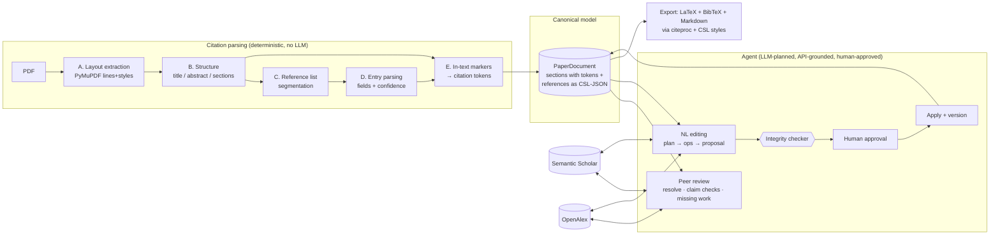
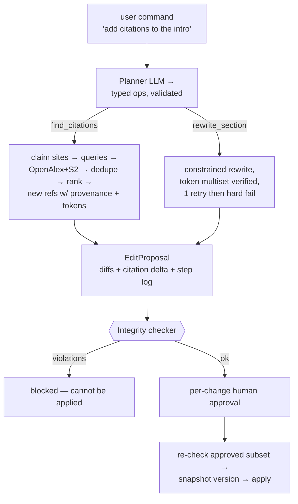

# System Design

Two pieces, as requested: **citation parsing** (how a PDF becomes parsable,
normalized citations) and **the agent** (how peer review and natural-language
editing work under the hood).



---

## Piece 1 — Citation parsing

**Goal:** PDF → a structured document whose *every* citation — in-text marker
or bibliography entry — is normalized into one canonical model (CSL-JSON),
with confidence scores and explicit failure surfacing at every stage.

The pipeline is five deterministic stages (`backend/app/parsing/`). No LLM is
involved in parsing: the same PDF always parses the same way, and every
decision is explainable. The UI shows the stage log verbatim.

### Stage A — Layout extraction (`pdf_extract.py`)

Input: PDF file → Output: ordered, styled text lines.

1. `page.get_text("dict")` gives blocks → lines → spans with bounding box,
   font name, size, and style flags (bold / italic / **superscript**).
2. Rotated lines are dropped (the arXiv margin watermark), with a count in
   the parse report.
3. Repeated headers/footers: any line in the top/bottom 10% of the page whose
   digit-normalized text recurs on ≥ 35% of pages is removed, as are bare
   page numbers.
4. Column detection per page: lines are split into full-width / left / right
   by x-extent; ≥ 5 lines on each side ⇒ two-column page. Reading order is
   column-major, with full-width lines (title block, wide tables) acting as
   vertical zone separators.
5. Marker re-join: LaTeX headings often extract as two lines at the same
   height ("3.1" + "Encoder and Decoder Stacks"); a bare section-number line
   is merged with the line to its right.
6. Body font size = the mode of span sizes weighted by character count —
   the reference point for "is this line set larger/bolder than body text?"

**Intermediate representation:** `Line{page, bbox, column, spans[{text, size,
font, flags}]}` — layout and style survive to the stages that need them.

### Stage B — Document structure (`structure.py`)

1. **Title** = the largest-font line block on page 1.
2. **Headings** = short lines that are (a) a known section name (Introduction,
   Methods, References, …) set apart at all (bold, larger, ALL-CAPS, or
   numbered), or (b) numbered (`3`, `3.1`, `IV.`, `A.`) *and* visually set
   apart *and* mostly alphabetic (rejects equations and list items). Level
   comes from numbering depth.
3. **Abstract** = an `Abstract` heading or an `Abstract—…` run-in.
4. Text between consecutive headings becomes a section, classified
   abstract / body / references / other.
5. Body flattening: de-hyphenation across line breaks, paragraph breaks on
   vertical gaps, and superscript numeric runs preserved as sentinels
   (`⟨sup:12,13⟩`) for stage E.

### Stage C — Reference-list segmentation (`reflist.py`)

The references section's *lines* (with layout) are segmented into entries by
three competing strategies, each returning a score; the best one wins and the
choice + score are reported:

| Strategy | Signal | Score |
|---|---|---|
| `numbered` | entries begin `[12]` / `12.` with near-monotonic numbers | sequence monotonicity + count |
| `hanging_indent` | entry starts at the column's left edge, continuations indented | fraction of entry-final line endings + avg length |
| `author_start` | line starts like an author list (`Surname, F.` / `F. Surname` / `Surname FM,`) and the previous line looks entry-final | fraction of entries containing a year |

If nothing scores ≥ 0.35 the list is kept as one block and **reported as a
segmentation failure** — never silently dropped. Hyphen-split words across
line breaks are re-joined; italic span runs are captured per entry as
title/venue hints.

### Stage D — Entry parsing (`refparse.py`)

Layered, deterministic field extraction; each layer removes what it matched:

1. **Identifiers** — DOI, arXiv id, URL (unambiguous regexes; a DOI is the
   strongest possible resolution key, so it is extracted first).
2. **Year** — `(2015)` (author-year styles) preferred, else a plausible
   standalone 19xx/20xx nearest the end (numbered styles). Both are
   range-guarded so `Science, 313(5786)` can't become "year 5786".
3. **Authors/title/venue split**, in order of reliability:
   - *quoted title* (IEEE): `authors "TITLE," venue`;
   - *APA anchor*: `authors (2015). title. venue`;
   - *sentence split* for dot-separated styles, with a chunker that knows
     initials (`D. P.`) don't end the author chunk **unless** the chunk
     already reads as a complete name list and the next word starts a new
     phrase (`…Salakhutdinov, R.R. Reducing the…`), and that `et al.` ends it.
4. **Author-list splitting** into `Family, Given` pairs. The genuinely
   ambiguous case — `Duchi, John, Hazan, Elad` (pairs) vs `Jimmy Lei Ba,
   Jamie Ryan Kiros` (one author per token) — is resolved by list-wide
   evidence (a comma inside the final "and"-part ⇒ pair mode; alternating
   surname-like/given-like single tokens ⇒ pair mode). Handles `&`, `;`,
   Vancouver (`Kingma DP`), particles (`van der Maaten`), and `et al.`
   (recorded as an issue, not dropped).
5. **Venue / volume / pages** from the remainder, with italic hints.
6. **Confidence** = weighted presence of authors (.3) + title (.3) +
   year (.2) + venue (.1) + identifier (.1). Entries under 0.5 are flagged
   `unparsed`: raw text kept, shown in the UI and in review findings.

**Where CSL-JSON fits:** `to_csl()` maps parsed fields into a CSL-JSON item
(`ref_N` id, csl type guessed from venue keywords, author family/given,
`issued` date-parts…). From this point on **CSL-JSON is the only citation
model in the system** — the parse metadata (confidence, issues, raw text)
lives alongside it, never instead of it. When a reference is later resolved
against OpenAlex/Semantic Scholar, its CSL-JSON is upgraded from the API
record (still under our `ref_N` id) — one model, provenance tracked.

### Stage E — In-text markers → tokens (`intext.py`)

A **probe pass** counts how many markers of each family actually *link* to
parsed reference entries:

- numeric brackets `[1, 4–7]` → via reference labels (ranges expanded,
  bounded);
- superscript runs (the stage-B sentinels) → via labels, but only trusted
  with ≥ 3 distinct linked numbers *and* no bracket style — this is the
  footnote-marker guard;
- author–year — parenthetical `(Kingma & Ba, 2015; Smith 2020a)` split on
  `;`, and narrative `Vaswani et al. (2017)` — linked by first-author family
  (exact, then fuzzy ≥ 88) + year, with `2020a/b` disambiguation by
  reference order.

The dominant family becomes the detected style (with a confidence = its share
of linked markers, shown in the UI); the tokenize pass then replaces each
**linked** marker with a canonical token in the section text:

```
[[citep:ref_1,ref_7]]   parenthetical group
[[citet:ref_3]]         narrative (author name stays in prose)
```

A marker that *looks* like a citation but doesn't link (e.g. `[42]` with no
reference 42) is left verbatim in the text and recorded as an unmatched
marker — surfaced in the parse report, never silently deleted.

**Why tokens are the central design decision:** the tokens in section text
are the *source of truth* for where citations live. Everything else — the
rendered labels, the bibliography, the LaTeX `\cite` commands, the integrity
checks — is derived from them. Because they're plain text, they survive being
passed through an LLM, and because they're trivially parseable, the integrity
checker can compare the multiset of cited ids before/after any edit in one
line of code. Citation style detection maps to a default CSL style (numeric →
`ieee`, superscript → `nature`, author-year → `apa`); the user can override
with any vendored `.csl` file, and all rendering flows through citeproc.

---

## Piece 2 — The agent

Two agent surfaces share one foundation: real external search
(OpenAlex + Semantic Scholar), the canonical CSL-JSON reference table, and
the token invariant.

### The API boundary (`external/`)

- Both clients (`openalex.py`, `semantic_scholar.py`) return `ExternalSource`
  objects built **only** from API responses — a source object cannot exist
  without an api id and clickable URL, which is what makes "never hallucinate
  a reference" structural rather than aspirational.
- Every GET goes through one function (`cache.cached_get`) providing: disk
  cache (reproducible demos, kind to free tiers; failures never cached),
  client-side rate limiting (S2 unauthenticated ≈ 1 rps), 429/5xx backoff
  honoring `Retry-After`, and typed `ApiError` on definitive failure.
- Callers must handle `ApiError`; in review it becomes a visible
  `SEARCH_FAILURE` finding, in resolution a `failed` status on the reference.
  An empty result is a result; a failed call is a failure — the two are never
  conflated.

### Reference resolution ladder (`external/resolve.py`)

`DOI → arXiv id → title search` (OpenAlex first, S2 as fallback), scored by
normalized-title similarity ± year/author agreement. ≥ 0.92 resolves;
0.75–0.92 is `ambiguous` (best candidate shown, not trusted); below is
`unresolved`. Resolution upgrades the reference's CSL-JSON and stores the
abstract for claim checking. Nothing is guessed: an unresolved reference
stays a parsed-but-unverified citation and is reported as such.

### Peer review (`review/`)

Runs as a background job with a live, persisted progress log (the UI shows
the raw log — including which queries ran and which failed).

**Claim–citation checks** (`claims.py`): for a sampled set of citation sites
(spread across sections and distinct references, capped for rate limits):

1. *Claim* = the sentence containing the token (extracted at parse time).
2. *Evidence* = the cited work's abstract from resolution. No abstract ⇒ the
   finding is `cannot verify` with the reason (unresolved / no abstract /
   lookup failed) — the app never fakes a verdict.
3. *Judgment* = one focused LLM call (temperature 0) returning
   `supports / partial / does_not_support / cannot_verify` + rationale +
   a verbatim quote from the abstract. The quote is verified against the
   abstract (fuzzy ≥ 85); a fabricated quote is discarded and the finding
   says so. `does_not_support` ⇒ high severity; `partial` ⇒ medium;
   supported citations are also shown (positive findings build trust in the
   negative ones).
4. No LLM configured ⇒ every check honestly reports "needs an LLM", with the
   fetched abstract shown for manual review.

**Missing work** (`missing.py`): per body section →

1. *Query building*: LLM extracts claims/topics and search queries; without
   an LLM, keyphrase heuristics are used and the provenance string says so
   ("heuristic keyphrases (no LLM configured)") — a keyword search is never
   dressed up as a semantic one.
2. Each query runs on **both** APIs.
3. *Dedupe* against the paper's own reference list (DOI, then arXiv id, then
   fuzzy title ≥ 0.90) and against the paper itself.
4. *Ranking*: LLM relevance rating of title+abstract against the claim
   (0–3), falling back to labelled keyword-overlap + citation-count ranking.
5. Each finding carries: the claim it relates to, the section, the full
   source (title/authors/venue/year/DOI/URL/abstract), the provenance line
   (`openalex search: "..." [LLM query builder (openai:gpt-4o-mini)]`), and a
   confidence.

### Natural-language editing (`agent/`)

A command becomes a **proposal**, never a direct mutation:



1. **Plan.** The planner LLM maps the command onto a deliberately small,
   *typed* op vocabulary — `find_citations{section, topic, max_new}` and
   `rewrite_section{section, instruction}` — at most 4 ops, validated against
   real section ids. The LLM chooses and parameterizes operations; it does
   not get to free-form edit the document. Unmappable or destructive
   commands ("delete all references") fail with the planner's stated reason.
2. **Execute.**
   - `find_citations`: the LLM proposes claim sentences (verified to actually
     exist in the section — an invented sentence is rejected and logged) with
     search queries; both APIs are searched; candidates already in the
     bibliography are dropped; the top-ranked candidate (relevance ≥ 0.5)
     becomes a new `Reference` whose CSL comes from the API record, with
     `added_by="agent"`, the reason, and the source URL; a `[[citep:ref_N]]`
     token is inserted before the claim sentence's final period. Finding
     nothing relevant is a logged no-op, not an excuse to pad.
   - `rewrite_section`: the rewrite prompt carries hard rules (every token
     preserved byte-for-byte and count-for-count, tokens stay attached to
     their statements, no new facts). The token multiset is checked; on
     mismatch the model gets one corrective retry with the exact missing/
     invented tokens; if it still fails, **no change is produced** — the
     step log shows why.
   Every step (plan, searches with counts, drafts, checks, errors) is
   recorded in the proposal and rendered in the UI.
3. **Integrity check** (`integrity.py`) — the non-negotiable:
   - *I1 no citation lost*: per changed section, after-multiset ⊇
     before-multiset; any shortfall must be covered by an explicit,
     user-visible removal acknowledgement, else it's a blocking violation.
   - *I2 no unknown citations*: every token id must exist in the document or
     the proposal's new references.
   - *I3 real provenance*: every agent-added reference must carry a resolved
     external source (api + URL) — a citation without a source cannot enter
     the system.
   - *I4 declared adds are real*: each claimed insertion must correspond to
     an actual token.
4. **Approve & apply** (`apply.py`): the user approves per section change
   (diff view with token-aware word diff, citation counts before/after, new
   sources listed with links). Apply re-runs the integrity check on the
   approved *subset* (approving change A while rejecting change B must not
   leave A citing a reference only B introduced — unneeded new refs are
   pruned), guards against stale bases (section changed since proposal),
   snapshots the document version (undoable history), then mutates. The
   version history and every agent-added source ship in the export's
   `PROVENANCE.md`.

### Export (`export/`)

The paper rebuilds as LaTeX: tokens → `\citep`/`\citet` (natbib) for
author-year styles or `\cite` for numeric; the bibliography is a
`thebibliography` whose entry text is **rendered by citeproc with the chosen
`.csl` file** — no hand-written citation formatting anywhere (the only
non-CSL strings are natbib's `\bibitem[label]` metadata, generated from CSL
fields). `references.bib` (CSL-JSON → BibTeX), `paper.md`, canonical
`paper.json`, and `PROVENANCE.md` round out the zip. Unparsed references
appear in the bibliography with their raw text, clearly marked — they are
never dropped from the export.

---

## Key decisions & tradeoffs

- **Own parsing pipeline instead of GROBID.** GROBID would likely win on raw
  extraction quality, but it's a Java service that turns the core of this
  assessment into a black box. The staged pipeline is documented,
  deterministic, unit-tested per stage, and every failure is attributable to
  a stage. (A GROBID adapter would slot in cleanly at stages C–D if quality
  demanded it later.)
- **Tokens over offsets.** Character offsets die on every edit; inline tokens
  survive LLM round-trips and make the citation-integrity invariant a
  multiset comparison.
- **Typed agent ops over free-form editing.** A single "here's the paper,
  edit it" prompt cannot give integrity guarantees. Small ops keep each LLM
  call narrow (plan / pick claims / rate relevance / rewrite), independently
  testable, and cheap to verify.
- **citeproc-py over citeproc-js.** One-language stack; the cost is known
  CSL gaps (bibliography `<sort>` not applied — worked around by registration
  order; `suppress-author` ignored — worked around for narrative labels;
  year-suffix disambiguation incomplete). Swapping in a citeproc-js sidecar
  is isolated to `cslproc/render.py`.
- **Live APIs + disk cache.** Every response is cached on disk keyed by
  request; failures are never cached. Demos are reproducible, free-tier
  limits are respected, and the honesty rule holds: a cache hit and a live
  call are indistinguishable *except* that failures always surface.
